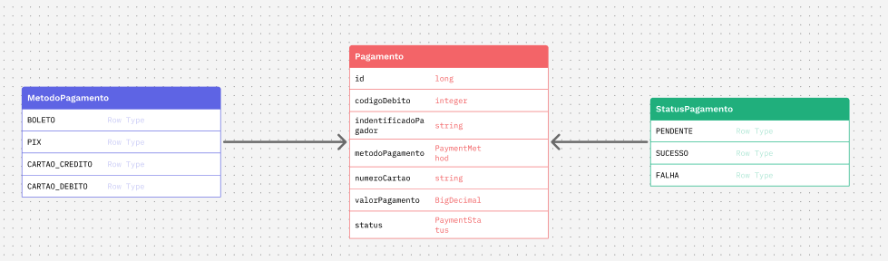

# 💳 Desafio Técnico - API de Pagamentos

Este projeto é uma API REST desenvolvida em **Java 17 com Spring Boot** para processar pagamentos de pessoas físicas e jurídicas. A API permite registrar pagamentos, atualizar status, consultar e aplicar filtros, além de realizar exclusão lógica conforme regras de negócio.

---

## 🚀 Tecnologias Utilizadas

* Java 17
* Spring Boot 3.x
* Spring Data JPA
* PostgreSQL (via Docker)
* Flyway (migrations)
* Lombok (boilerplate reduction)
* JUnit & Mockito (testes)
* Swagger/OpenAPI 

---

## 📐 Diagrama UML

A seguir, o diagrama de entidade principal `Pagamento`, com os enums relacionados:



* `Pagamento`: representa um pagamento com método, valor, status e dados do pagador.
* `MetodoPagamento`: enum com BOLETO, PIX, CARTAO_CREDITO e CARTAO_DEBITO.
* `StatusPagamento`: enum com PENDENTE_PROCESSAMENTO, PROCESSADO_SUCESSO e PROCESSADO_FALHA.

---

## 🧱 Estrutura do Projeto

```
src/
├── controller/     # Endpoints REST
├── dto/            # Objetos de transferência de dados
├── service/        # Regras de negócio
├── repository/     # Acesso a dados com Spring Data JPA
├── model/          # Entidades JPA
├── mapper/         # Conversão entre entidades e DTOs
└── exception/       # Tratamento de erros centralizado
```

---

## ▶️ Rodando o Projeto Localmente

### Script automatizado (Linux/Mac)

Você pode usar o seguinte script para subir o banco, aplicar as migrations e levantar a aplicação automaticamente:
```bash
./scripts/start.sh
```
> O script está localizado na pasta `/scripts`

O servidor ficará disponível em `http://localhost:8080`

### Script automatizado (Windows)

> Para executar, basta dar dois cliques no arquivo `init.bat` ou rodar via terminal.

> O script está localizado na pasta `/scripts`

O servidor ficará disponível em `http://localhost:8080`

## ▶️ Caso prefira sem scripts
### Pré-requisitos:

* Docker instalado
* Java instalado 

#### 🐳 Executando com Docker

### Subir o banco PostgreSQL:

```bash
docker-compose up -d
```

> Isso criará o banco `payments` e executará as migrations iniciais via Flyway.

---

### Gerar a imagem da aplicação

Para criar a imagem da aplicação e executá-la junto com o banco, use:

```bash
docker build -t pagamentos-api .
docker run --name pagamentos-api-container -p 8080:8080 --network="host" pagamentos-api
```

> A imagem será construída com o nome `pagamentos-api`, e a aplicação ficará disponível em `http://localhost:8080`.

---

## 🔎 Endpoints Principais

| Método | Rota                      | Descrição                           |
| ------ | ------------------------- | ----------------------------------- |
| POST   | `/pagamentos`             | Criar novo pagamento                |
| PATCH  | `/pagamentos/{id}/status` | Atualizar status do pagamento       |
| GET    | `/pagamentos`             | Listar pagamentos com filtros       |
| DELETE | `/pagamentos/{id}`        | Exclusão lógica (se ainda pendente) |

### 📥 Exemplo de payload para criação de pagamento (POST `/pagamentos`)

```json
{
  "codigoDebito": 12345,
  "cpfCnpj": "12345678909",
  "metodoPagamento": "CARTAO_CREDITO",
  "numeroCartao": "4111111111111111",
  "valor": 150.75
}
```

---

## 🧠 Regras de Negócio (Status)

* `PENDENTE_PROCESSAMENTO` → pode virar `PROCESSADO_SUCESSO` ou `PROCESSADO_FALHA`
* `PROCESSADO_FALHA` → pode voltar para `PENDENTE_PROCESSAMENTO`
* `PROCESSADO_SUCESSO` → não pode ser alterado

### 🔐 Autenticação

> Esta API não requer autenticação para os endpoints fornecidos (desafio técnico).

---

## 📂 ADRs e Documentação Técnica

Todas as decisões arquiteturais estão documentadas na pasta `docs/ADRS`:

* `ADR-001`: Spring Boot com Java 17
* `ADR-002`: PostgreSQL via Docker
* `ADR-003`: Estrutura em Camadas
* `ADR-004`: Spring Data JPA
* `ADR-005`: Lombok
* `ADR-006`: Flyway

---

### 📚 Documentação Swagger

Após subir a aplicação, acesse:
[http://localhost:8080/swagger-ui.html](http://localhost:8080/swagger-ui.html)

---

### 🧹 Limpando os containers Docker

```bash
docker stop pagamentos-api-container
docker rm pagamentos-api-container
docker-compose down
```
